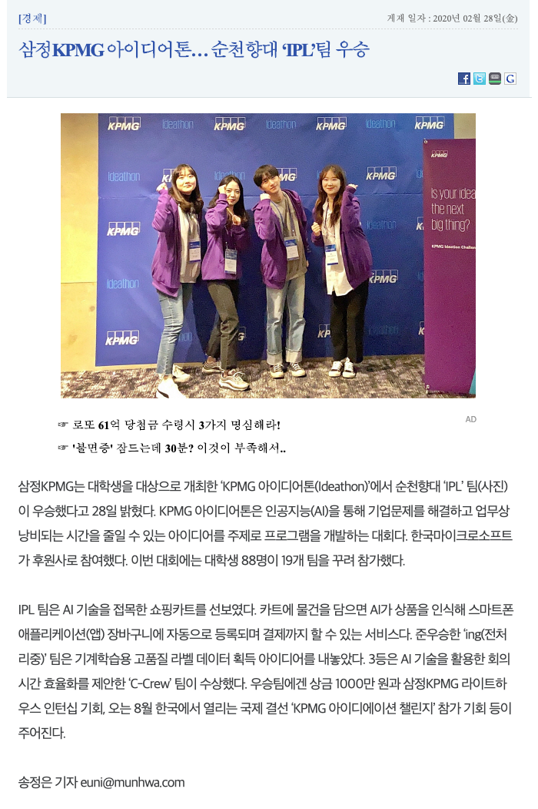
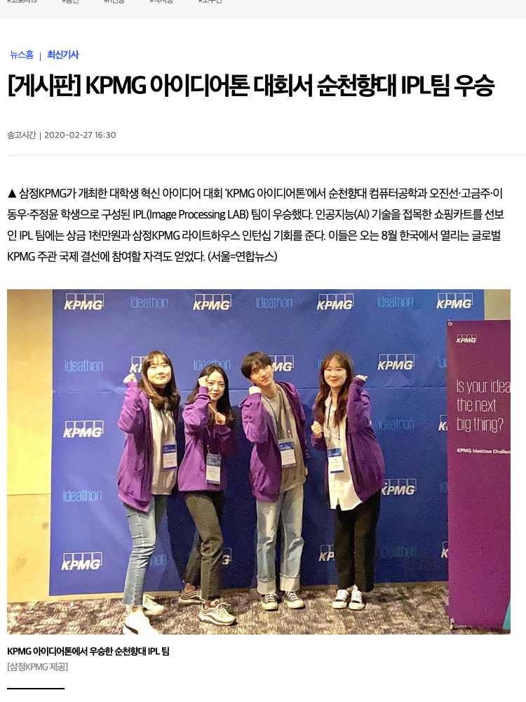

```{r setup, include=FALSE}
library(flexdashboard)
```

PR {data-icon="fa-newspaper"}
=============================================================================

Column
--------------------------------------------------------------------------------

### 'KPMG Ideathon’ 개최 사후 보도결과

```{r read-news}
library(tidyverse)
library(readxl)

press_table <- read_excel("data/Media_KPMG_Ideathon.xlsx",
                          skip=2, sheet="Table1")

press_df <- press_table %>% 
  set_names(c("No", "날짜", "매체명", "기사제목", "기타", "기자")) %>% 
  select(-`No`, -`기타`) %>% 
  filter(!is.na(`날짜`))
  

press_df %>% 
  mutate(`기사제목` = str_sub(`기사제목`, 1, 20)) %>% 
  DT::datatable()
```

Column {.tabset}
-------------------------------------

### Munhwa(문화일보)

```{r read-news-munhwa, eval = FALSE}
library(webshot)

webshot("http://www.munhwa.com/news/view.html?no=2020022801073621337001", cliprect=c(5, 450, 700, 1050), "fig/mw.png")
```



### YNA(연합뉴스)

```{r read-news-yh, eval = FALSE}

webshot("https://www.yna.co.kr/view/AKR20200227167200008", cliprect=c(5, 170, 750, 1000), "fig/yh.png")
```

