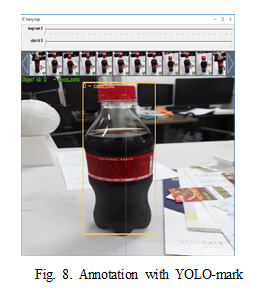
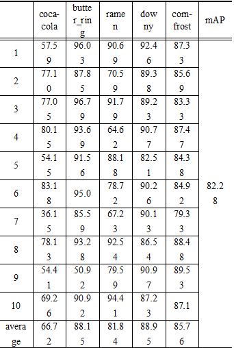

#  서론

기존 쇼핑 환경에서 사용되는 결제 시스템은 많은 인력과 소요 시간을 필요로 한다. 
최근에는 딥러닝 기술의 발전에 따라 새로운 패러다임의 쇼핑환경을 제공하는 무인 상점이 등장하였다. 
대표적인 무인 상점이 “아마존 고(Amazon Go)”이다. 
아마존 고에서는 계산을 위하여 줄을 설 필요가 없다. 
무인 상점은 계산에 소요되는 시간을 크게 단축하는 사용자 경험을 지원한다는 점에서 의미가 크다. 
따라서 국내외적으로 이에 대한 관심이 증가하고 있다\cite{wankhede2018just}.

무인 상점의 대표 모델로 제시되는 “아마존 고“의 경우, 수백 대의 카메라와 마이크, 압력 센서들이 고객을 실시간으로 추적하여 고객과 상품 간의 접촉을 판단한다. 
매장에 들어오는 고객이 자신의 스마트폰을 입구에 설치된 기기에 스캔하면, 이 때부터 매장 안에서 고객은 시스템의 3D 목표물로 표시된다. 
하지만 아마존 고에는 결정적인 약점이 있는데 인공지능 판독 문제로 매장 내 수용 인원을 100여 명으로 제한하고 있다. 
또 아마존 고에서는 모든 이용객의 이동경로를 추적하고 분석하기 때문에, 데이터 수집량이 매우 커지게 되고, 따라서 대형 유통망에 확대 적용하기에는 무리가 있다. 

본 논문에서는 앞서 출시된 무인 상점의 단점을 최소화하기 위하여 딥러닝 객체 탐지와 라즈베리파이를 사용한 스마트 쇼핑카트를 제안하고자 한다. 
제안된 시스템은 카메라와 초음파 센서, 무게 센서, TCP/IP 기반 네트워킹 기능, 딥러닝 서버, 안드로이드 기반의 사용자 스마트폰 앱으로 구성되어있다. 
무인 상점에서는 이 시스템을 통해 실시간으로 쇼핑카트에 투입된 상품의 번호와 수량, 상품 투입 정보를 사용자의 기기로 전송할 수 있어 가상의 장바구니 목록에 상품을 추가하거나 삭제할 수 있다. 

스마트 쇼핑 카트는 현재 몇 개의 방법들이 제안되어 있다. 
대부분의 스마트 쇼핑 카트는 사용자 인터페이스상의 얼굴 인식 기능을 통해, 고객을 인식하고 RFID (Radio-Frequency Identification) 태그를 사용하여 카트에 추가되는 다양한 제품을 자동으로 탐지하고 관련 정보를 사용자 인터페이스에 표시한다. 
하지만 RFID를 모든 제품에 부착하려면 비용과 많은 노력이 필요하다. 
본 논문에서는 RFID 대신에 카메라를 사용하여 상품들을 인식하므로 모든 상품에 RFID 태그가 부착될 필요가 없다\cite{chiang2016development, karjol2017iot}. 

본 논문의 구성은 다음과 같다. 
2장에서는 딥러닝 객체탐지와 라즈베리파이를 사용한 스마트 쇼핑카트의 개요와 시스템 설계를 설명한다. 
3장에서 각 모듈별 구현 세부사항과 실험을 통한 본 시스템의 성능에 관하여 기술한다. 
끝으로 4장에서 결론 및 향후 연구 방향에 대하여 기술한다. 

#  스마트 쇼핑 카트 시스템의 설계

## 개요

Fig. 1과 Fig. 2에서는 본 논문에서 제안한 스마트 쇼핑카트의 프로토타입을 보여준다. 
스마트 쇼핑카트는 상품이 카트로 투입되는 것을 탐지하는 초음파 센서, 상품을 인식하는 파이카메라, 전체 시스템을 제어하고 네트워크 통신을 맡은 라즈베리파이, 쇼핑카트에 놓인 상품들의 무게를 측정하는 무게센서로 구성된다. 

Fig. 1.Front view of Smart Shopping Cart

Fig. 2.Back view of Smart Shopping Cart

Fig. 3에서는 제안된 스마트 쇼핑 카트 시스템을 구성하는 구성요소들과 인터페이스를 보여준다.  

Fig. 3.System schematic diagram of smart shopping cart

쇼핑카트와 딥러닝 서버는 TCP/IP 통신 기능을 이용하고 중앙 서버와 안드로이드 앱도 TCP/IP 통신을 사용한다. 
데이터베이스 서버와 안드로이드 앱은 HTTP 프로토콜을 사용한다.  

스마트 쇼핑카트에 사용된 하드웨어 및 소프트웨어 모듈들은 Table 1과 같다.  

Table 1.Overview of the modules used in Smart Shopping Cart

## 스마트 쇼핑카트의 설계 요구사항

스마트 쇼핑 카트를 설계할 때, 고려하였던 요구사항들은 다음과 같다.  
* 쇼핑의 편의성을 위하여 무선 배터리로 작동해야한다. 
* 최소 전력만을 소모해야 한다. 
* 카트에 동시에 여러 상품이 들어오거나 나가더라도 인식가능해야 한다. 
* 상품이 들어온 것인지 나간 것인지도 구분할 수 있어야 한다.  

## 스마트 쇼핑카트의 동작 순서
스마트 쇼핑카트의 동작 순서는 다음과 같다. 
사용자가 쇼핑카트와 자신의 스마트폰을 연결시키며 쇼핑이 시작된다.  
연결이 완료된 이후 사용자가 상품을 담거나 꺼내게 되면 쇼핑카트의 초음파 센서가 이를 인식하여 카트에 부착된 카메라로부터 입력된 영상을 7초 동안 라즈베리 파이에 저장한다.  
이어서 TCP/IP 네트워크를 통해 스트리밍이 시작되었음을 알리는 메시지를 중앙 서버에게 송신한다.  
중앙 서버는 라즈베리 파이에서 영상을 읽어온 후에 딥러닝을 이용하여 (상품의 종류,  수량, 출입 여부)를 판단하고 이 정보를 TCP/IP 네트워크를 이용하여 사용자의 스마트폰의 안드로이드 앱으로 전달한다.  
TCP/IP 메시지를 수신한 해당 앱에서는 가상 장바구니에 상품 데이터를 추가하거나 삭제한다. 
쇼핑이 완료되면 사용자는 스마트폰에서 결제를 하고 쇼핑카트를 원래 위치로 반납한 후 마트에서 퇴장하며 쇼핑이 종료되고 쇼핑카트는 충전이 시작된다.  
앞에서 설명한 과정을 Fig. 4에 나타내었다.  

Fig. 4.System operation diagram of smart shopping cart

#  스마트 쇼핑 카트 시스템의 세부 구현
## 스마트 쇼핑카트의 구현

스마트 쇼핑카트에는 라즈베리파이 보드를 부착하였다.  
해당 보드에 내장된 Wi-Fi 네트워크 기능을 이용하여 인터넷에 접속해 중앙 서버와의 TCP/IP 서버-클라이언트 네트워크를 구현한다.  
영상을 받아들이기 위하여 파이 카메라를 이용하였다.  
파이 카메라와 MJPG Streamer 이용하여 jpg 형식의 촬영을 연속적으로 수행한 후에 라즈베리파이 호스트의 특정포트로 실시간으로 영상을 스트리밍한다.  
중앙서버에서는 해당 URL을 이용하여 영상 리소스에 접근할 수 있다.  

## 전력 절약 방법

스마트 쇼핑카트는 배터리를 부탁하여서 동작하므로 전력을 절약하는 것이 매우 중요하다.  
본 시스템에서는 Fig. 1에서 보는 바와 같이 초음파센서를 카트의 상단에 부착하여 이것을 영상 스트리밍의 트리거로 사용한다.  
즉 영상은 쇼핑시간 내내 전송되는 것이 아니라 카트에 물건을 담거나 꺼낼 때에만 영상 전송을 시행하고, 이를 중앙 서버에게 알리도록 하는 비동기 방식의 전송을 구현하였다.  
초음파센서는 탐지 범위가 쇼핑카트의 면적에 비하여 다소 좁은 편이므로 프로토타입에서는 세 개의 센서를 사용하여 이 점을 보완함으로써 정확도를 높였다.  

## 무게 센서의 이용

상품이 쇼핑카트 안으로 들어오는 것인지 밖으로 나가는 것인지를 판단하기 위한 방법으로 무게센서를 활용하였다. Fig. 1에서 보는 바와 같이 무게 센서를 쇼핑카트의 바닥에 설치하고, 이전 무게 대비 현재 무게를 비교하여 증감여부를 판단한다.  

## 안드로이드 앱

사용자는 앱 실행한 후에 자신이 고른 쇼핑 카트에 적혀진 단말기 고유 번호를 입력한다.  
스마트 폰의 고유 번호와 해당 카트의 고유 번호가 중앙 서버에서 매핑이 되면 쇼핑 환경이 갖춰진 것이므로 쇼핑을 시작하면 된다.  
안드로이드 앱은 서버가 인식한 상품의 번호와 수량, 출입정보 데이터를 임시로 저장한다.  
이후 마트의 상품 데이터들이 저장되어 있는 데이터베이스에 상품번호로 해당 상품을 조회하는 쿼리문을 보내고 응답으로 조회된 상품과 관련된 세부 정보들이 담긴 데이터를 받아 앱의 가상 장바구니에 추가하거나 삭제한다.  
쇼핑이 완료되면 결제하기를 이용하여 총 구매내역과 산정된 금액을 보여주며 결제로 이어지도록 구현했다.
앱의 일부 화면을 Fig. 5에 보였다. 

Fig. 5.The Screen of the Smartphone App

## 객체 탐지 모듈

스마트 쇼핑카트에서 카트에 담기는 상품을 정확하게 인식하는 것은 아주 중요한 작업이다.  
쇼핑카트는 카메라를 통하여 이미지를 받은 후에 이미지 안의 객체를 탐지하고 객체의 위치를 정확하게 파악하여야 한다.  
우리는 사용자가 카트로 동시에 여러 개의 상품을 담는 상황도 고려하여야 한다.  

본 논문에서는 딥러닝 기술 중 하나인 그리드 기반의 객체 탐지를 제공하는 YOLO 라이브러리(You Only Look Once, 이하 YOLO)를 사용한다.  
YOLO는 분류기 역할 뿐 아니라 위치 알고리즘도 내장되어, 한 이미지 안에서 여러 객체를 탐지할 수 있도록 구현된 오픈소스 라이브러리이다\cite{redmon2016you}. 

YOLO는 이전까지의 객체 탐지 신경망보다 우수한 성능을 제공하는 오픈소스 라이브러리이며, 파일 형식의 영상데이터 뿐 아니라 웹캠을 통한 영상에 대해서도 실시간 탐지까지 지원하는 강력한 실시간 객체 탐지 라이브러리이다. 
YOLO는 합성곱 신경망(Convolutionay Neural Network, 이하 CNN)에 기반을 두고 있어 합성곱 계층과 서브샘플링 계층을 거치는 등 입력 이미지의 크기를 점차 다운샘플링하는 컨볼루션 기반의 아키텍처를 제공한다.  
Fig. 6에서는 YOLO에 내장된 네트워크의 전 연결 신경망(Fully Connected Network, 이하 FCN)의 앞단, 즉 합성곱 계층을 보여준다. 

Fig. 6.Neural network architecture of YOLO object detection

YOLO는 하나의 CNN을 사용하여 이미지 전체에서 다수의 bounding box를 예측하고, 동시에 각 박스에서 class probability를 계산하는 통합된 모델을 사용한다.  
Fig. 7은 YOLO 학습이 완료된 이후에 상품을 인식하는 과정을 보여준다.  

Fig. 7.Workflow of YOLO object detection
YOLO는 기존의 R-CNN보다는 약 1000배, Fast R-CNN보다는 약 100배, 가장 최근에 나온 Faster R-CNN보다도 약 10배 이상 빠른 성능을 보인다[7]. 

## YOLO 학습 과정

YOLO도 지도학습으로 문제를 해결하는 것이기 때문에 레이블링이 잘 된 양질의 데이터 확보가 필요하다. 
객체 탐지 문제의 경우에는 정답 레이블은 각 객체의 레이블명과 경계박스의 쌍으로 구성되며 이를 Annotation이라고 부른다.  

본 연구에서는 5개의 상품 클래스만을 가정하였고 각 클래스 당 촬영을 통하여 300-500장 정도 학습 데이터를 생성하였다. 
이 학습 데이터는  Fig. 8에서 보듯이 Annotation tool인 YOLO-mark을 이용하여 총 2800장의 학습용 데이터의 리사이징 및 라벨링 등의 전처리 작업을 진행하였다. 

Fig. 8.Annotation with YOLO-mark

YOLO 신경망에 대한 학습률은 0.001, 모멘텀은 0.9, weight decay는 0.0005로 설정하였으며, 16200 epoch 동안 학습을 진행하였고 최종 Loss 함수 값은 Fig. 9에서와 같이 0.0616으로 확인되었다. 
프로토타입 모델에서는 threshold를 0.6으로 높여주어 잘못된 상품이 입력되는 비율을 줄였다.  

Fig. 9.Graph of loss function after training 16200 epochs

## 상품 인식률 실험

학습이 종료되면 학습된 가중치 파일을 가지고 실시간 탐지를 테스트해볼 수 있다. 
상품 중에서 콜라, 버터링, 라면, 다우니, 콘프로스트의 5종의 상품을 가지고 테스트하였다. 
1회의 트리거 당 스트리밍 데이터를 가져와서 실시간으로 39회의 탐지를 실행하는데 이 39회에 대한 평균 탐지 정밀도를 계산하여 한 회차의 결과로 기록하였다. 
이 과정을 상품 클래스별로 각 10회씩 시행하였고, 각 클래스별 평균 예측 값들로부터 본 시스템 전체의 평균 예측 정밀도(mean Average Precision, mAP)를 산정하였다. 
이 결과를 Table 2에 나타내었다. 
본 시스템의 평균 정확도는 82.28%로 평가되었다.  

Table 2.AP of each classes and mAP

Table 2에서 특정 테스트 회차에서의 인식률이 해당 클래스 평균 정확도에 비해 다소 낮게 측정된 경우가 있는 것을 알 수 있는데, 그 이유는 고의적으로 상품을 회전시키는 등, 인식이 어려울 수 있는 환경을 만들어 테스트를 했기 때문이다. 

YOLO는 다른 탐지시스템과 비교하여 가장 빠른 속도로 실시간 객체 탐지를 제공한다는 강력한 장점을 지녔지만, 이전의 탐지 시스템에 비하여 작은 물체에 대해서는 검출률이 떨어진다는 단점이 있어 이를 개선하기 위한 YOLO의 장점과 이전의 객체 탐지 시스템의 장점을 모두 고려한 SSD(Single Shot Multibox Detector, 이하 SSD)라는 새로운 객체 탐지시스템도 대두가 되고 있다. 
SSD는 YOLO와 비교하여 속도는 떨어지나 성능은 우수하다\cite{ren2015faster, liu2016ssd}.

#  결론

무인 상점의 대표주자로 알려진 아마존 고의 정확도는 합격점이라는 평가가 잇따르며, 아마존 고의 아이디어와 기술력은 인정받았지만, 널리 확산시키기엔 상당한 비용이 든다. 
또 입장할 수 있는 고객의 수가 한정적이다.  

본 논문에서 제안된 스마트카트 시스템은 다른 무인 상점 솔루션에 비하여 높은 가성비를 제공한다. 
제안된 시스템에서는 수용 인원이 증가하더라도 별 영향을 받지 않는다. 
또 비교적 적은 컴퓨팅 자원을 사용한다. 
또 기존의 방법처럼 모든 상품에 RFID를 부착할 필요가 없다.  

상품 탐지 분야에 있어서 속도와 정확도는 트레이드-오프 관계인데, 본 시스템은 실시간 처리를 요구하기 때문에 YOLO를 응용하여 구현하였다. 
차후 이 부분은 객체 탐지 모델의 수정 및 변경을 통하여 충분히 성능을 더 높일 수 있으리라고 추측한다. 

