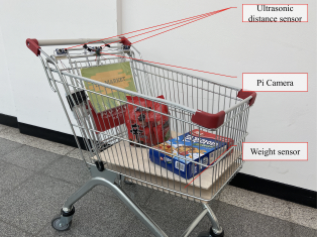
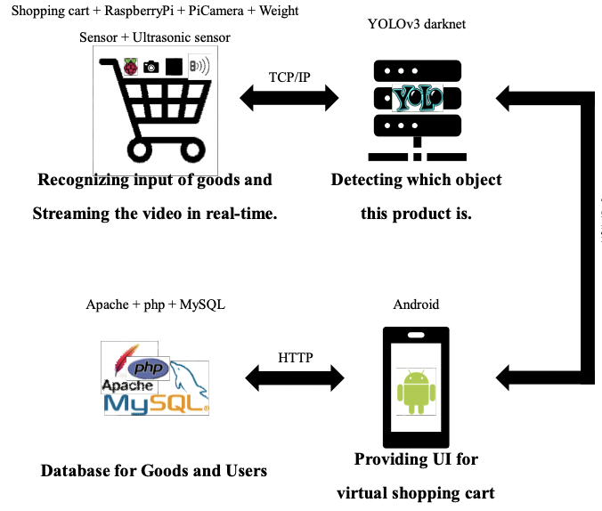
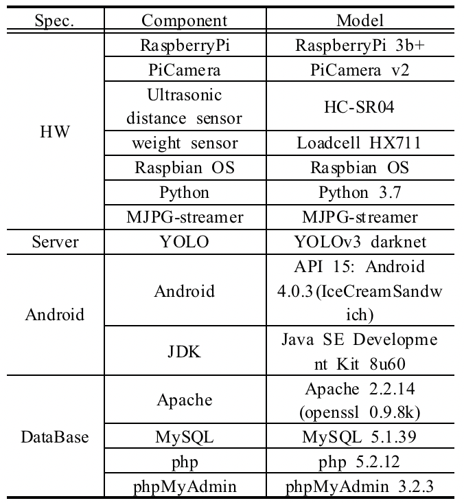
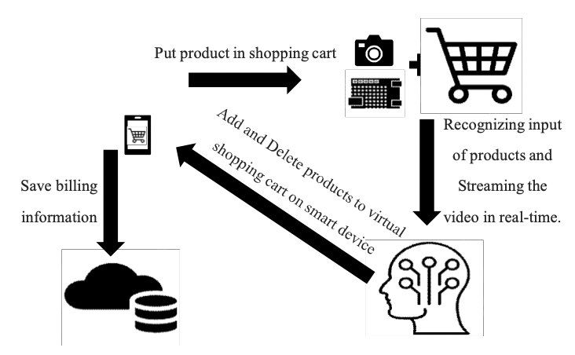
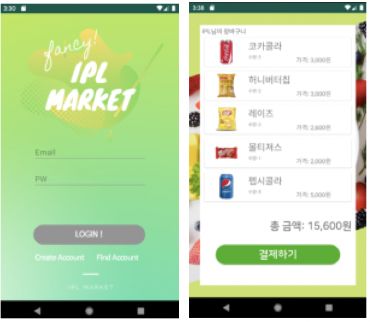
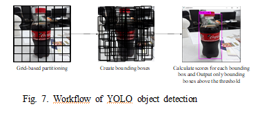
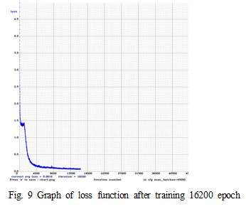

#  Introduction

Payment System is used for shopping environments in general requires a lot of manpower and time.
Recently, With the development of deep learning technology, unmanned stores that provide a new paradigm shopping environment have appeared.
The representative unmanned shop is “Amazon Go”.
In Amazon Go, there is no need to line up for calculation.
Unmanned stores are significant in that they support a user experience that significantly reduces the time it takes to calculate.
Therefore, there is increasing interest in this at home and abroad\cite{wankhede2018just}.

In the case of “Amazon Go”, which is presented as a representative model of unmanned stores, hundreds of cameras, microphones, and pressure sensors track customers in real time to determine contact between customers and products.
When a customer entering a store scans his smartphone on a device installed at the entrance, the customer is displayed as a 3D target of the system from this point.
However, Amazon Go has a decisive weakness that is limiting the number of people in the store to more than 100 due to AI reading problems.
In addition, Amazon Go tracks and analyzes the movement paths of all users, so the amount of data collected becomes very large.
Therefore, it is difficult to apply it to large distribution networks.

In this paper, we propose a smart shopping cart using deep learning object detection and Raspberry Pi to minimize the disadvantages of the unmanned store.
The proposed system consists of a camera, ultrasonic sensor, weight sensor, TCP / IP-based networking function, deep learning server, and Android-based user smartphone app.
In an unmanned store, threre can be added to or deleted from the virtual shopping cart list because through this system, the number, quantity, and product input information of the product input into the shopping cart can be transmitted to the user's device in real time.

Several methods of smart shopping carts are currently proposed.
Most smart shopping carts recognize customers through face recognition on the user interface and use RFID (Radio-Frequency Identification) tags to automatically detect various products added to the cart and display relevant information on the user interface.
However, attaching RFID to all products requires cost and effort.
In this paper, it is not necessary to have RFID tags attached to all products because products are recognized using cameras instead of RFID\cite{chiang2016development, karjol2017iot}.

The composition of this paper is as follows.
Chapter 2 explains an overview of smart shopping cart and system design using deep learning object detection and Raspberry Pi.
Chapter 3 describes the implementation details of each module and the performance of this system through experiments.
Finally, Chapter 4 describes the conclusions and future research directions.

#  Design of smart shopping cart system

## Summary

Fig. 1 and Fig. 2 shows the prototype of the smart shopping cart proposed in this paper.
The smart shopping cart consists of an ultrasonic sensor that detects that the product is being put into the cart, a pie camera that recognizes the product, a raspberry pie that controls the entire system and performs network communication, and a weight sensor that measures the weight of the products placed in the shopping cart.

Fig. 1.Front view of Smart Shopping Cart

Fig. 2.Back view of Smart Shopping Cart

Fig. 3 shows the components and interfaces that make up the proposed smart shopping cart system.

Fig. 3.System schematic diagram of smart shopping cart

Shopping cart and deep learning server use TCP / IP communication function.
And central server and Android app also use TCP / IP communication.
The database server and Android app use the HTTP protocol.

The hardware and software modules used in the smart shopping cart is the same as Table 1.

Table 1.Overview of the modules used in Smart Shopping Cart

## Design requirements for smart shopping cart

When designing smart shopping carts, the following requirements were considered. 
* For convenience of shopping, it should be operated with a wireless battery.
* Only minimal power should be consumed.
* It must be recognizable even if several products are simultaneously in or out of the cart.
* It should be seperated whether a product came in or out.

## The order of operation of smart shopping cart

The order of operation of smart shopping cart is as follows.  
Shopping begins when the user connects the shopping cart with his smartphone. 
After the connection is complete, the ultrasonic sensor in the shopping cart recognizes the product when the user puts or pulls out the product and stores the video entered from the camera attached to the cart in the Raspberry Pi for seven seconds. 
Then, it sends a message to the central server indicating that streaming has started over the TCP/IP network. 
The central server reads the video from the raspberry pie and then uses deep learning to determine (the type, quantity, and entry or exit of the product) and passes this information to the Android app on the user's smartphone using a TCP/IP network. 
Upon receiving the tcp/ip message, the app adds or deletes product data in the virtual shopping cart. 
When shopping is completed, the user pays with his or her smartphone, returns the shopping cart to its original location and exits the mart while closing their shopping. 
Then the shopping cart begins charging. 
The above-mentioned process is shown in Fig. 4

Fig. 4.System operation diagram of smart shopping cart

#  Detailed implementation of smart shopping cart systems

## Implementing smart shopping cart

The smart shopping cart has a Raspberry Pi board. 
It uses Wi-Fi network features built into the board to connect to the Internet and implement TCP/IP server-client networks with the central server. 
We used a Pi Camera to accept the video. 
Using a pie camera and an MJPG streamer, the video is streamed to a specific port on the raspberry pie host in real time after continuous jpg-type filming. 
The central server can access video resources using the URL. 

## Power Saving Method

It is very important to save power because smart shopping cart operates by asking for batteries. As seen in Figure 1, this system attaches an ultrasonic sensor to the top of the cart and uses it as a trigger for image streaming. 
In other words, the video was implemented as an asynchronous transmission that would require the central server to be notified only when the products were put in or taken out of the cart without continuing to be transmitted during shopping hours. 
Since ultrasonic sensors have a narrow detection range compared to the area of shopping carts, the prototype uses three sensors to compensate for this point to increase accuracy. 

## Using a Weight Sensor

Weight sensors were used as a way to determine whether a product enters or goes out of a shopping cart.
As seen in Figure 1, the weight sensor is installed on the bottom of the shopping cart and the current weight compared to the previous weight to determine whether to increase or decrease.

## Android Application

After the user runs the app, the user enters the terminal unique number written on the shopping cart chosen by oneself.
Once the unique number of the smartphone and the cart are mapped on the central server, the shopping environment is in place, so you can start shopping. 
Android application temporarily store product number, quantities and access information data recognized by the server.
Afterwards, it sends a query to the database where the product data of the mart is stored and receives data containing details related to the product inquired by the product number and adds or deletes it in the app's virtual shopping cart.
When shopping is completed, it is implemented to show the total purchase details and calculated amount using payment.
Some screens of the application were shown in Fig. 5.

Fig. 5.The Screen of the Smartphone App

## Object detection

In a smart shopping cart, it is a very important task to accurately recognize the products added to the cart.
After receiving the image through the camera, the shopping cart should detect the object in the image and accurately figure out the location of the object. 
We should also consider the situation in which the user puts several products into the cart at the same time.

The smart cart system proposed in this paper uses a YOLO library (You Only Look Once, hereinafter YOLO), which provides grid-based object detection, one of the deep learning technologies. 
YOLO is an open source library that implements not only a classifier but also location algorithms, enabling multiple objects to be detected within one image\cite{redmon2016you}.

YOLO is an open-source library that provides better performance than previous object detection neural networks, and is a powerful real-time object detection system that supports real-time detection of videos via webcam as well as file format video data.
Because YOLO is based on CNN, it provides a convolution-based architecture that gradually downsamples the size of the input image, such as going through the convolutional layer and subsampling layers. 
Fig. 6 shows the convolutional layer in front of the fully connected neural network (FCN) of the network embedded in YOLO.

YOLO uses a single CNN to predict a number of bouncing boxes across the image, and uses an integrated model to calculate class probability in each box at the same time. Fig. 7. shows the progess of detecting products after training.

YOLO performs about 1,000 times faster than traditional R-CNN, about 100 times faster than Fast R-CNN, and about 10 times faster than the most recent Faster R-CNN [7].

Fig. 6.Neural network architecture of YOLO object detection

YOLO는 하나의 CNN을 사용하여 이미지 전체에서 다수의 bounding box를 예측하고, 동시에 각 박스에서 class probability를 계산하는 통합된 모델을 사용한다. 
Fig. 7은 YOLO 학습이 완료된 이후에 상품을 인식하는 과정을 보여준다. 

Fig. 7.Workflow of YOLO object detection
YOLO는 기존의 R-CNN보다는 약 1000배, Fast R-CNN보다는 약 100배, 가장 최근에 나온 Faster R-CNN보다도 약 10배 이상 빠른 성능을 보인다[7].

## YOLO Learning Process

Since YOLO also solves the problem through supervised learning, it is necessary to secure high-quality, well-labeled data.
In the case of the object detection problem, the correct answer label consists of a pair of each object's label name and a bounding box, and this is called an annotation.

In this study, only 5 product classes were assumed, and 300-500 learning data were generated through shooting using cameras for each class. 
As shown in Fig. 8, this learning data was pre-processed such as resizing and labeling of 2,800 learning data using the annotation tool YOLO-mark.

The learning rate for the YOLO neural network was set to 0.001, the momentum to 0.9, and the weight decay to 0.0005.
As shown in 9, the training was conducted for 16200 epochs, and the final Loss function value was found to be 0.0616.
In the prototype model, we increased the threshold to 0.6 to reduce the rate at which the wrong product was entered.

Fig. 8.Annotation with YOLO-mark

YOLO 신경망에 대한 학습률은 0.001, 모멘텀은 0.9, weight decay는 0.0005로 설정하였으며, 16200 epoch 동안 학습을 진행하였고 최종 Loss 함수 값은 Fig. 9에서와 같이 0.0616으로 확인되었다.
프로토타입 모델에서는 threshold를 0.6으로 높여주어 잘못된 상품이 입력되는 비율을 줄였다. 

Fig. 9.Graph of loss function after training 16200 epochs

## experiment for the ratio of product recognition

When learning is finished, real-time detection can be tested with a file containing the learned weights.
We tested with five products: Coke, Buttering, Ramen, Downey and Confrost.
Streaming data is fetched and the number of detections per trigger in real time is 39.
The average detection precision for these 39 detection result is calculated and recorded as the result of  one round.
This process was performed 10 times for each product class, and the mean average precision (mAP) of the entire system was calculated from the average prediction values for each class.
Table 2 shows the results. The Map of the system was estimated to be 82.28%.

Table 2.AP of each classes and mAP

In Table 2, it can be seen that the recognition rate at a specific test round was measured slightly lower than the average accuracy of the class.
The reason for this is that we tested by creating an environment that can be difficult to recognize, such as intentionally rotating a product.

YOLO has the strong advantage of providing real-time object detection at the fastest speed compared to other detection systems, but it has the disadvantage that the detection rate is low for small objects compared to previous detection systems.
A new object detection system called SSD (Single Shot Multibox Detector, SSD) that considers all the advantages is also emerging.
SSDs are slower than YOLO, but are superior in performance \cite{ren2015faster, liu2016ssd}.

#  Conclusion

The accuracy of Amazon Go, known as the representative of unmanned shops, is said to be successful, and Amazon Go's ideas and skills have been recognized by the public, but it is expensive to spread widely. 
Also, the number of customers who can enter at the same time is limited.

The smart cart system proposed in this paper provides a higher cost-performance ratio than other unmanned store solutions.
In the proposed system, even if the capacity increases, it is not affected.
It also uses relatively little computing resources.
Also, it is not necessary to attach RFID to all products as in the conventional method.

In the field of product detection, speed and accuracy are trade-off, but since this system requires real-time processing, it was implemented by applying YOLO. 
In the future, it is assumed that this part can be improved sufficiently by modifying and changing the object detection model.

